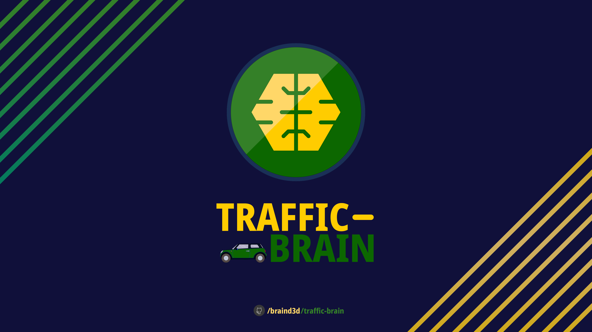
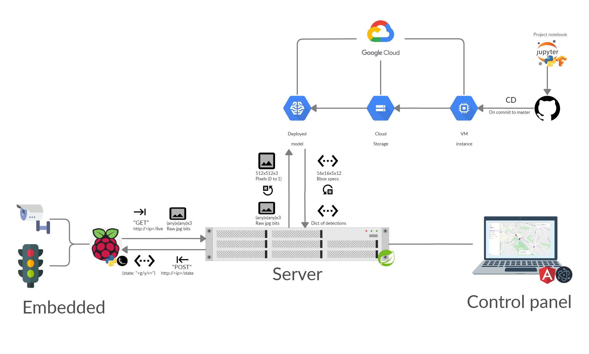

# Traffic Brain
> Traffic Brain is an open-source traffic light control system. Using a classifier, information about the current road situation is collected and automated light switch decision is made based on it.

## Get started

The project consists of 4 main components:
- **Object recognition** for traffic detection (located in "[/classification](/classification)")
- **Main server** controlling all the traffic light nodes (located in "[/server](/server)")
- **Embedded server** and **traffic light schematics** (located in "[/embedded](/embedded)")
- **Front-end client** for communicating with the server (still incomplete; located in "[/client](/client)")

For each of the components' directories there is a coresponding `README.md` with instructions on how to get started.

## Authors
- **Angel Penchev** ([@angel-penchev](https://github.com/angel-penchev)) - Object detection neural network, Embedded traffic light
- **Bogdan Mironov** ([@bogdanmironov](https://github.com/bogdanmironov)) - Main controlling server
- **Simeon Georgiev** ([@simo1209](https://github.com/simo1209)) - Thank you for helping me out to complete the embedded <3

## Contributions
1. Fork it (<https://github.com/braind3d/traffic-brain/fork>)
2. Create your feature branch (`git checkout -b feature/fooBar`)
3. Commit your changes (`git commit -a`)
4. Push to the branch (`git push origin feature/fooBar`)
5. Create a new Pull Request
6. Upon review it will be merged.

## License
Distributed under the MIT license. See [LICENSE](LICENSE) for more information.