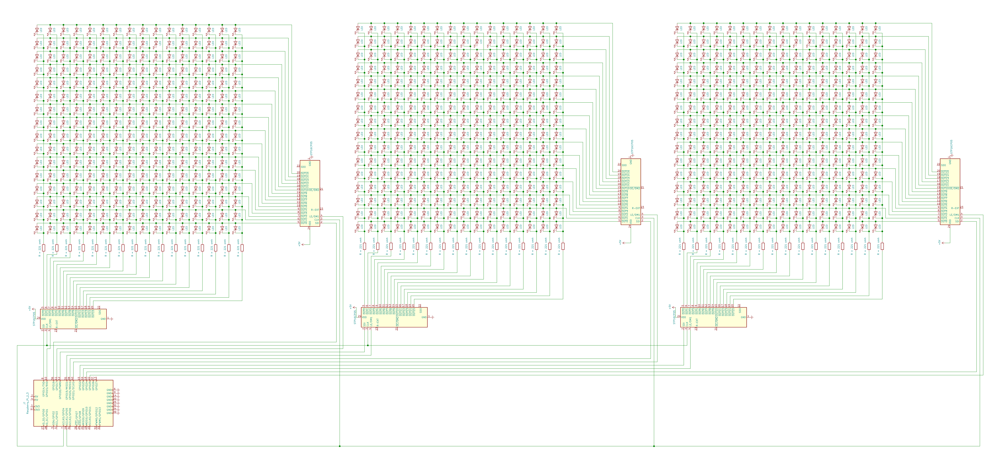

# Embedded
The embedded part of this project is conserned with the end point traffic light device. It contains a schematic on the device's architecture and a local server for communicating with the main server.

<p align="center">
<a href="https://github.com/braind3d/traffic-brain/actions?query=workflow%3A%22Embedded+CI">

</a>

<a href="https://github.com/braind3d/traffic-brain/issues?q=is%3Aopen+is%3Aissue+label%3Aembedded">

</a>

<a href="https://github.com/braind3d/traffic-brain/issues?q=is%3Aissue+label%3Aembedded+is%3Aclosed">

</a>

<a href="LICENSE">

</a>
</p>

## Scematic
Below is the schematic used to construct a single traffic light node.


### Parts used:
- *1x* **Raspberry Pi**
- *3x* **PCB P16D boards**
- *12x* **SNx4HC164 8-Bit Parallel-Out Serial Shift Registers**
- *96x* **221Ω resistors**
- *256x* **Red LEDs**
- *256x* **Yellow LEDs**
- *256x* **Green LEDs**

## Server
This Flask server is running locally on the Raspberry Pi. It is responsible for providing camera image server and controlling the lights through the GPIO on a main server request.

### Get started
The following setup has been testet on the `Raspberry Pi 3` with `Raspbian Buster Lite`.

#### Starting the server

Make sure Python 3.7 is installed. Then run the following:
```
# Install dependencies
$ python3.7 -m pip install pip
$ pip3 install -r requirements.txt

# Run the local server
$ flask run
```

#### Setting the server to start on boot
```
$ sudo echo "python3.7 $PWD/app.py" >> $HOME/.bashrc
```

### Built With
**Python 3.7** with the following libraries:
- Flask
- OpenCV

## License
Distributed under the MIT license. See [LICENSE](../LICENSE) for more information.